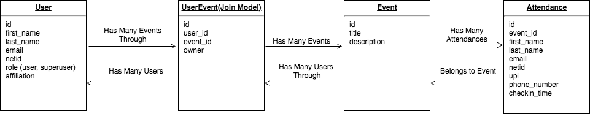

# CardSwipr
## Features
### Event Attendance
CardSwipr helps event organizers take attendance at meetings and events. Users log in via CAS and create and manage events. The day of an event, Attendees can swipe in via an easy interface using their Yale ID. The application looks up attendees and collects their information in a list. When the event ends, organizers can download a spreadsheet (.csv) of the attendees' information.

## Architecture
CardSwipr is meant to be deployed to Heroku with a PostgreSQL backend.



## Contributing
### Getting Started

### Using Docker:
This method requires Docker-Compose to be installed on your system. You can find information on that here: [Docker-Compose](https://github.com/Yelp/docker-compose/blob/master/docs/install.md)

```
# Clone the repo
git clone https://gitlab.com/yale-sdmp/cardswipr.git
cd cardswipr

# Set up .env file
cp .env.development .env
# Uncomment the commented out section for docker and fill in required environment variables
# Note: leave any unneeded variables blank after the equals sign

#  Create the containers
docker-compose build
docker-compose up -d

# Note: `docker-compose build` will only need to be re-run if modifying anything in the `config/` folder.
```

#### Local installation:
Make sure to have the specified Ruby version installed on your machine. We suggest using either [rbenv](https://github.com/rbenv/rbenv) or [asdf](https://github.com/asdf-vm/asdf) if you need multiple concurrent versions of Ruby installed.

You will also need PostgreSQL installed on your machine.

```
# Clone the repo
git clone https://gitlab.com/yale-sdmp/cardswipr.git
cd cardswipr

# Configure the database
cp config/database.yml.local config/database.yml

# Set up environment variables
cp .env.development .env
# Fill out required environment variables, leaving any unneeded variables as blank after the equals sign

./bin/setup
```

# About
## Support or Contact
If you have trouble or questions about this application, email the managers of the [Student Developer & Mentorship Program](http://yalestc.github.io) at `dev-mgt@yale.edu`.
