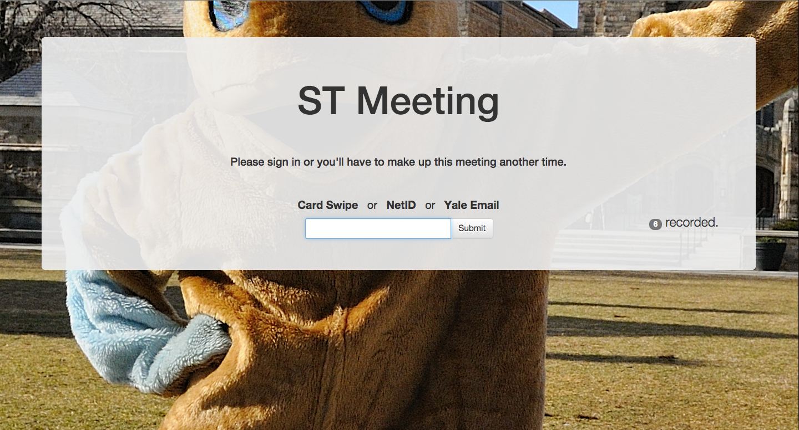

[](https://codeclimate.com/github/YaleSTC/cardswipr)
[](https://codeclimate.com/github/YaleSTC/cardswipr)
[](https://gemnasium.com/YaleSTC/cardswipr)
[](http://inch-ci.org/github/yalestc/cardswipr)


# CardSwipr
## Features
### Event Attendance
CardSwipr helps you take attendance at meetings and events. Attendees swipe in with this easy interface, the application looks them up in the Yale Phonebook, and collects their information in a list. When the event's over you can even download a `.csv` output of the attendees' information.




### General Lookup
CardSwipr can quickly take you to a person's Yale Phonebook entry and open a Service Now Incident for them. This feature is used in some Walk-In Computing Support centers around campus.


### More input than you'll need
In the same box, users can input any of the following "unique identifying information".

- USB Magstrip Reader (registers as keyboard input)
- USB Barcode Scanner (registers as keyboard input)
- Keyboard 
  - NetID
  - Yale Email
  - UPI

### More output than you'll use
You'll get the most useful information about your attendees from the Yale Phonebook, including:
  - First Name, Nickname, Last Name
  - Yale Email Address
  - NetID
  - UPI
  - School
  - College Name, College Abbreviation
  - Class Year
  - On-Campus Telephone (often inaccurate)
  - On-Campus Mailing Address (often inaccurate)

# How It Works
## Yale LDAP
For most input we just lookup the information in LDAP (the protocol powering the Yale Phonebook). This includes `netid`, `yale email`, and `upi`. We use the open source [YaleLDAP](http://github.com/YaleSTC/yaleldap) gem to make this easy. You could use this gem in your applications too!

## Yale ID Card Databases
For `magstrip` and `barcode` lookups we connect to a Yale database on the backend. This is more difficult for others to get access to, but we're working on an API that may become available to certain individuals who register with us.


# Contributing
## Set Up
### secret_token
Make your own `secret_token` by following the file `/config/initializers/secret_token.example`. Use `rake secret` to generate your own secret key, and keep this private.

### ruby-oci8 gem
To set this up, you must install the ruby-oci8 gem by following the instructions here:
https://github.com/kubo/ruby-oci8/blob/master/docs/install-instant-client.md

Troubleshooting install: 
Make sure to change all the commands for the OS you're using and your version numbers e.g. .so -> .dylib, the 11_number _ things
Also you may need to do ruby -e "require 'oci8'"

### Database Connection Information
A sample database.yml is available in Yale's private git repository (but it is private). This application is not configured to run without a username/password to the right Yale database. We're working on replacing this with a web API for the same information through Layer 7.

### Standard Rails Application Setup
```
bundle install
rake db:create
rake db:schema:load
rails server
```

## Application Structure
Each of the models have a comment above them explaining what the purpose of the model is.

# About
## Authors and Contributors
Lovingly created for the Yale Community by Casey Watts (@caseywatts), based on work by Adam Bray (@adambray).

## Support or Contact
If you have trouble or questions about this application, email the managers of the [Student Developer & Mentorship Program](http://yalestc.github.io) at `dev-mgt@yale.edu`.
