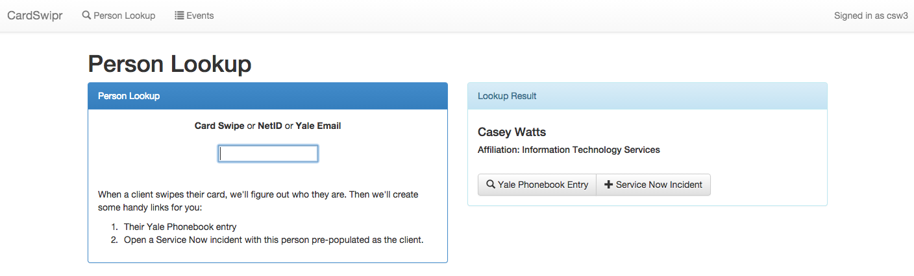

# CardSwipr
## Features
### Event Attendance
CardSwipr helps you take attendance at meetings and events. Attendees swipe in with this easy interface, the application looks them up in the Yale Phonebook, and collects their information in a list. When the event's over you can even download a spreadsheet (`.csv`) output of the attendees' information.

### General Lookup
CardSwipr can quickly tell you about a person after they swipe their card. It can both take you to a person's Yale Phonebook entry and open a Service Now Incident with their name already filled out. This feature is used in some Walk-In Computing Support centers around campus.

### More input than you'll need
In the same box, users can input any of the following "unique identifying information".

- USB Magstrip Reader (registers as keyboard input)
- USB Barcode Scanner (registers as keyboard input)
- Keyboard
  - NetID
  - Yale Email
  - UPI

NOTE: the input field should be kept focused so the input generated by the reader will directly entered into it.

### More output than you'll use
You'll get the following information about your attendees upon swipe-in:
  - First Name, Nickname, Last Name
  - Yale Email Address
  - Phone Number
  - NetID
  - UPI

You can also get more information by following the link to the Yale Directory.

# Contributing
This application uses a private Yale APIs that require client-side SSL certificates and other confidential information.
The credentials will be shared only with
trusted developers, which quite likely limits the pool of
possible contributors to Yale community members. Please contact the management at `dev-mgt@yale.edu` if you have any questions.

Developers should benefit from [Development Notes](DEVELOPMENT.md).

# About
## Authors and Contributors
Lovingly created for the Yale Community by Casey Watts (@caseywatts), based on work by Adam Bray (@adambray).

## Support or Contact
If you have trouble or questions about this application, email the managers of the [Student Developer & Mentorship Program](http://yalestc.github.io) at `dev-mgt@yale.edu`.
